**
 🛡️ Welcome to my GitHub profile! 🛡️ 
**

I'm Erik, a responsible and results-oriented Go/JavaScript developer, as well as a passionate cybersecurity enthusiast, eager to research, for which use the platform - HTB (HackTheBox).

  

  
  
  

  <h3>Badges</h3>
  
  
  

